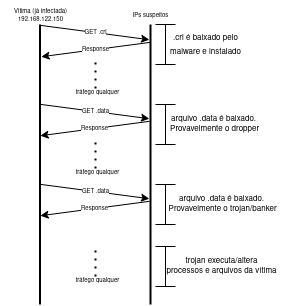

# Análise de pacotes de tráfego de rede

Esse documento tem como objetivo apresentar uma análise de pacotes de tráfego de rede, utilizando o software Wireshark para a matéria de segurança computacional.

## 1. Introdução

Esse relatório será organizado no seguinte formato:

- [Introdução](#1-introdução)
- [IPs e portas](#2-ips-e-portas)
  - [IPs](#21-ips)
  - [Portas](#22-portas)
- [Domínios e arquivos acessados](#3-domínios-e-arquivos-acessados)
  - [Arquivos](#31-arquivos)
- [Analise do hash do arquivo pcap](#4-analise-do-hash-do-arquivo-pcap)
- [Comportamento do malware](#5-comportamento-do-malware)
- [Diagrama de sequência](#6-diagrama-de-sequência)
- [Conclusão](#7-conclusão)

## 2. IPs e portas

Podemos encontrar os IPs e portas acessando a aba `Statistics` e depois `IPV4 Statistics` e `Destination and Ports`.

Veremos os IPS e as portas acessadas durante a captura de pacotes.
  ***

### 2.1. IPs

Os IPs encontrados foram e dados de cada `whois` são:

- 192.168.122.150 (IP não roteável)
  - Provavelmente é o IP da máquina que está capturando os pacotes.

- 192.16.48.200:

  - `NetRange:       192.16.0.0 - 192.16.63.255`
  - `Organization:   Edgecast Inc. (EDGEC-25)`
  - `Country:        US`
  - `City:           Los Angeles`

- 13.107.42.13

  - `NetRange:       13.64.0.0 - 13.107.255.255`
  - `Organization:   Microsoft Corporation (MSFT)`
  - `Country:        US`
  - `City:           Redmond`

- 104.18.25.243

  - `NetRange:       104.16.0.0 - 104.31.255.255`
  - `OrgName:        Cloudflare, Inc.`
  - `Country:        US`
  - `City:           San Francisco`

  ***

### 2.2. Portas

As portas encontradas, para cada ip foram:

- `192.168.122.150`:
  - Diversas portas foram abertas em um range de 65191 a 65370
  - A porta com maior número de pacotes foi a `65351` sendo 0,7% do total de pacotes capturados.

- `192.16.48.200`:
  - TCP 80 (HTTP)

- `13.107.42.13`:
  - TCP 443 (HTTPS)

- `104.18.25.243`:
  - TCP 80 (HTTP)
  
***

## 3. Domínios e arquivos acessados

Conseguimos encontrar os dominios acessados através da aba `file` e depois `export objects` e `HTTP`.

Os domínios e arquivos encontrados foram:

- `ocsp.msocsp.com/MFQwUjBQME4wTDAJBgUrDgMCGgUABBSIGkp0%2Fv9GUvNUu1EP06Tu7%2BChyAQUkZ47RGw9V5xCdyo010%2FRzEqXLNoCEyAABq89CezPkMgbDeEAAAAGrz0%3D`
  - É possível encontrar o GET request dessa URL usando `tcp.stream eq 1` no wireshark.
  - Observamos que o `User-Agent` é `Microsoft-CryptoAPI/6.1`
  - Caso procuremos essa URL no `Virus Total` apenas o antivírus `CRDF` a classifica como `maliciosa`.

- `mscrl.microsoft.com/pki/mscorp/crl/Microsoft%20IT%20TLS%20CA%202.crl`
  - É possível encontrar o GET request dessa URL usando `tcp.stream eq 2` no wireshark.
  - Se procurarmos por essa URL no `Virus Total` nenhum antivírus a classifica como `maliciosa`. Entretanto a mesma url aparece varias vezes em `grafos` da comunidade do Virus Total.

  ***

### 3.1. Arquivos

Podemos baixar os dois arquivos indicados pelas URLs acima e analisá-los:

- Executar os comandos `file` e `strings` nos arquivos baixados não resulta em nada interessante.
- Porem se pesquisarmos o arquivo que é baixado através da URL `ocsp.msocsp.com/MFQwUjBQME4wTDAJBgUrDgMCGgUABBSIGkp0%2Fv9GUvNUu1EP06Tu7%2BChyAQUkZ47RGw9V5xCdyo010%2FRzEqXLNoCEyAABq89CezPkMgbDeEAAAAGrz0%3D` podemos ver que ele aparece em diversas relações de grafos do `Virus Total` como um `Win32.EXE`.

Já, o arquivo baixado através da URL `mscrl.microsoft.com/pki/mscorp/crl/Microsoft%20IT%20TLS%20CA%202.crl` é um arquivo `CRL` (Certificate Revocation List) que é uma lista de certificados revogados. Possívelmente esse sertificado será utilizado para `validar sites que na realidade são falsos`.

***

## 4. Analise do hash do arquivo pcap

Podemos analisar o hash contido no nome do arquivo pcap: `aefe508fa350c26791218eeeb78166b2` no `Virus Total` e veremos que ele é classificado como `malicioso` por diversos antivírus. A grande maioria o classifica como um `trojan` ou `dropper`.

O `Virus Total` indica que o nome popular dele é: `trojan.fareit/noon`

Podemos ver também que o seu nome original, de acordo com o Virus Total, é `Unhomogene.exe`
***

## 5. Comportamento do malware

Vamos utilizar as abas de `Details` e `Behavior` do `Virus Total` para analisar o comportamento do malware.

  ***

### 5.1. Detalhes

Informações claras como podem:

- `SHA256:d337c1dbac1de2e9399ea1d5bc2ed2f1223bd8cbcdf8cbb2e495b19b936d6441`
- `File type: Win32 EXE`
- `Imports: MSVBVM60.DLL`

Essa importação em especial, `MSVBVM60.DLL`, é um arquivo que contém funções para a linguagem `Visual Basic 6.0` e é utilizado para compilar programas escritos nessa linguagem. Isso indica que o malware foi escrito em `Visual Basic 6.0`.

  ***

### 5.2. Comportamento

Existem 4 sandboxs que analisaram o malware e podemos ver o comportamento dele sumarizado:

Ao que parece o malware baixa um certificado e o instala no computador. Depois ele acessa a url: `https://onedrive.live.com:80/download?cid=e61e5f3f655316fa&resid=e61e5f3f655316fa%21125&authkey=ab5cy3xsz3addbe`. Essa url `não apareceu no pcap`, mas é possível que ela tenha sido acessada antes do pcap começar a ser capturado.

Além disso, o malware abre ou modifica diversos arquivos, entre eles podemos listar alguns que são mais suspeitos:

- Abertos:
  - `<DRIVERS>\etc\hosts`
  - `C:\Documents and Settings\Administrator\Local Settings\Temp\EB93A6\996E.exe`
  - `C:\Documents and Settings\Administrator\Cookies\index.dat`
  - `C:\WINDOWS\system32\update.exe`
- Modificados:
  - `%APPDATA%\Microsoft\Windows\Cookies\index.dat`
  - `%LOCALAPPDATA%\Microsoft\Windows\History\History.IE5\index.dat`
  - `%LOCALAPPDATA%\Microsoft\Windows\<INETFILES>\Content.IE5\index.dat`

O malware também deleta algumas chaves no registro do windows:

- `<HKCU>\Software\Microsoft\Windows\CurrentVersion\Internet Settings\ZoneMap\\ProxyBypass`
- `<HKCU>\Software\Microsoft\Windows\CurrentVersion\Internet Settings\ZoneMap\\IntranetName`

Essa comportamento indica que o malware: procura por arquivos de cookies, modifica o histórico de cookies e deleta configurações de proxy e intranet que são característica de um `banker`.

***

## 6. Diagrama de sequência

A seguir, um diagrama de sequência que representa os eventos que ocorrem no pcap:

***

## 7. Conclusão

O pcap analisado representa o tráfego de um usuário já infectado. O malware que infectou o usuário é um `banker` que tenta roubar informações bancárias do usuário. Ele faz isso instalando um certificado no computador e depois acessando um site falso que utiliza esse certificado para se passar por um site legítimo. O malware também modifica o histórico de cookies e deleta configurações de proxy e intranet.

O nome do malware é `trojan.fareit/noon` ele está associado à `CVE-2017-11882` que explora uma corrupção de memória no `Microsoft Office` e permite a execução de código arbitrário.

***

## Autor

Vinícius Fontoura de Abreu - GRR20206873
